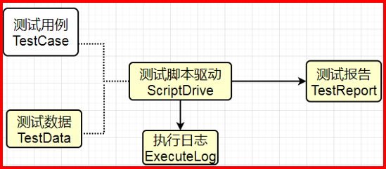

## Auto Test Framework v3.0
> API & UI Auto Test framework using Python + pytest + playwright + allure

English | [简体中文](./README.md)

- Simple architecture diagram




## Features
- Interface data dependency: Interface B can use a field from Interface A's response as a parameter
- Dynamic multiple assertions: Dynamically extract actual results and compare them with expected results
- SQL query assertion support
- UI test case development based on PO (Page Object) pattern
- Rewritten source page and context methods with session persistence support
- Automatically update online test case status after test completion (e.g., passed, failed, skipped...)
- Automatically generate allure test reports after test completion

## Directory Structure
```shell
├─config
│  └─config.yaml	# Configuration file
├─log
│  └─YYYY-MM-DD.log	# Log files
├─page
  └─home.py		# UI layer base encapsulation
├─recordings	# Location for recorded step files, AI can reference elements here
├─report
│  ├─data           # allure test result data
│  ├─html			      # allure reports
│  └─video		      # allure reports
├─test-result       # Test output path for recordings and screenshots
├─test_case
|  └─UI
|    ├─Test_Katana
|    |  ├─actions       # [NEW] Action Registry
|    |  |  ├─__init__.py # Registry entry point
|    |  |  ├─base.py     # Base actions (open, click, fill)
|    |  |  ├─module.py   # Module-related actions
|    |  |  ├─product.py  # Product-related actions
|    |  |  ├─form.py     # Form-related actions
|    |  |  └─layout.py   # Layout verification actions
|    |  ├─conftest.py   # UI test initialization (multi-environment support)
|    |  ├─test_ui.py    # [Refactored] Core test execution engine (dispatcher)
|    |  ├─Katana_curator_smoke_staging.yaml # Staging environment test cases
|    |  └─Katana_curator_smoke.yaml         # Release environment test cases
|
├─tools		            # Utility package
│  ├─__init__.py		  # Common method encapsulation
│  ├─data_process.py	# Dependency data processing
│  ├─sql_operate.py   # Database operations
│  ├─email_send.py    # Email sending
│  ├─encode.py        # Interface encryption/decryption
│  ├─generate_data.py # Test data generation
│  ├─read_file.py     # YAML file retrieval wrapper
│  └─get_cookie.py    # Cookie retrieval for login
│  └─update_test_status.py    # Update online test case status
├─requirements.txt		# Project dependency file
└─main.py	# Main startup file
```

## Getting Started
1. Install dependencies: `pip install -r requirements.txt`
```shell
Note: If the target deployment server cannot access the internet, you can download dependencies to the packages/ folder using the command `pip download -d packages/ -r requirements.txt`, and then install offline on the target server using `pip install --no-index --find-links=packages/ -r requirements.txt`
```

2. Write UI test cases
```
UI Test Case Writing Guide
Write according to the following specifications, using keyword-driven test execution
Case naming: For easy management and neat appearance, it is recommended to use a unified naming convention, such as xxx(project)-xxx(module)-test001
description (test case description)
test_step (test steps) Writing example:   test_step: { "open": "https://www.jd.com/",
                                "click1": "id=msShortcutLogin",
                                "fill1": {"selector": "#sb_form_q", "value": "test_account20221212"},
                                "swipe": {"x": 500, y: 800}
                                "sleep": 3000
                               }
Supported keywords include: open (open URL), click1 (click event, 1 represents the first click, similarly click2 represents the second click in the test case)
sleep (explicit wait, in milliseconds), fill1 (text fill event, requires two key-value pairs: one for the element to fill and one for the value. The number 1 usage is the same as click1)
swipe (page swipe event)
expect_result (expected result) Writing example: {  "description": "Expected page '#header > span.text-header' element text is 'JD Login Registration'",
                                   "selector": "#header > span.text-header",
                                    "value": "JD Login Registration"
                                   }
```
3. Start tests using `python main.py` command
4. View reports and results


## V3.0 Action Registry Architecture Upgrade

To support multi-developer collaboration and improve code maintainability, we have introduced the Action Registry pattern under `test_case/UI/Test_Katana/actions/`.

### Core Changes
1. **Modular Actions**: Business logic is no longer piled in `test_ui.py`. It has been split into `module.py`, `product.py`, `form.py`, etc.
2. **Dynamic Dispatch**: `test_ui.py` becomes a thin client, only responsible for reading YAML and dynamically calling corresponding handler functions via `get_action(key)`.
3. **Registry**: `actions/__init__.py` maintains the mapping between keywords and functions.

### How to Add New Test Steps
1. Find or create an appropriate module file in the `actions/` directory (e.g., `new_feature.py`).
2. Write the corresponding handler function `def my_new_action(page: Page, v: dict): ...`.
3. Import the function in `actions/__init__.py` and register it in the `ACTIONS` dictionary: `"my_new_step_key": my_new_action`.
4. Use the key in the YAML test case: `my_new_step_key: { param: value }`.

### Multi-Environment Support
Switch environments using the `--env` command line parameter (staging/release), and the system will automatically load the corresponding YAML configuration file.
- Staging: `pytest --env staging ...` (loads `_staging.yaml`)
- Release: `pytest --env release ...` (loads default or `_release.yaml`)
